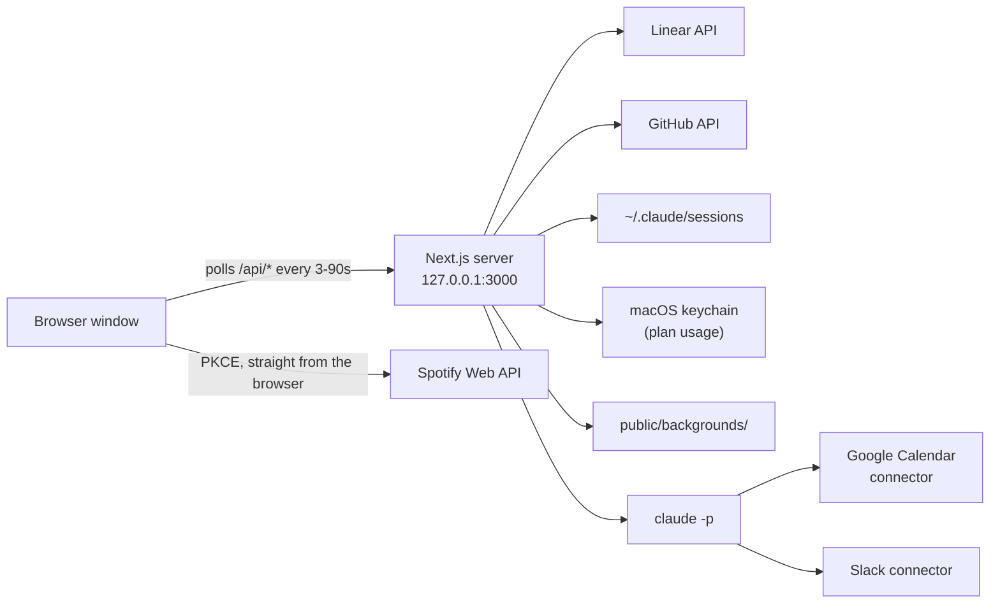
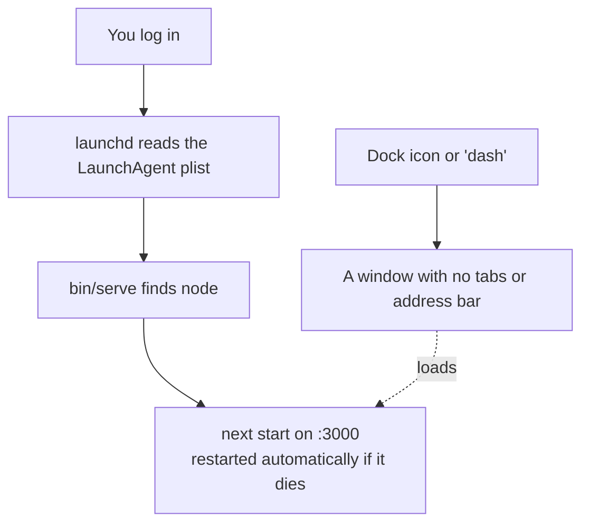

# Dashboard

> A personal command center that runs on your own Mac. Your work on one screen, over a background
> you choose, with an end-of-day summary written for you.

It pulls together the things you'd otherwise have five tabs open for — the issues in your current
Linear cycle, the pull requests waiting on your review, the Claude Code sessions running on your
machine, and your Spotify player — and lays them over any image or video you want. At 4:40 PM it
collects everything you did that day and has Claude write it up.

It is **not** a website. It's a small web server that starts when you log in and never leaves, with
a window that points at it. Nothing leaves your machine except the API calls you'd make anyway.

```
┌──────────────────────────────────────────────────────────────────────────┐
│  ■ DASHBOARD                               ♪ Now playing      [settings] │
│                                                                          │
│         ┌──────────────── Daily report · headline ──────────────┐        │
│                                                                          │
│  ┌─── ISSUES ────┐           8:47 AM            ┌─── REVIEWS ───┐        │
│  │ ENG-412       │      Tuesday, October 6      │ 0 waiting     │        │
│  │ ENG-408       │                              └───────────────┘        │
│  │ ENG-401       │     13       0        2      ┌─── AGENTS ────┐        │
│  │ …             │    open   review   agents    │ 4 sessions    │        │
│  └───────────────┘                              │ Claude usage  │        │
│                        ← your wallpaper →       └───────────────┘        │
└──────────────────────────────────────────────────────────────────────────┘
```

---

## What's on it

| Panel | What it shows | Needs |
| --- | --- | --- |
| **Issues** | Your Linear issues in the active cycle, grouped by status, with priority, labels, SLA countdowns and story points. Issues in triage collapse at the bottom. | Linear API key |
| **Reviews** | Open pull requests where your review is requested, grouped by repository. | GitHub login |
| **Agents** | Claude Code sessions running right now — spinner while working, check when done — with project, branch and last prompt. Sessions that just finished flash green. | Claude Code |
| **Claude usage** | The same plan limits as `/usage`: 5-hour session, weekly, per-model. | Claude Code |
| **Spotify** | Play, pause, skip, shuffle, switch devices, pick a playlist, stream in the window. | Spotify Premium |
| **Daily report** | What you did today, written by Claude at 4:40 PM. | Claude Code |
| **Clock** | Time, date, and a live count of what's open, waiting and running. | — |

Every panel switches off in Settings, and each one works without the others.

---

## Quick start

```bash
npm install
cp .env.example .env.local     # then fill in what you use
npm run dev
```

Open **<http://127.0.0.1:3000>** — use `127.0.0.1`, not `localhost`, or Spotify's login will reject
the redirect.

That's the development server. To make it a permanent part of your Mac, see
[Running it as a Mac app](#running-it-as-a-mac-app).

> **`.env.local` is only read at startup.** Restart the server after you change it.

---

## Setting up each service

Skip anything you don't use and switch that panel off in Settings.

<details>
<summary><b>Linear</b> — the Issues panel</summary>

1. In Linear: **Settings → Security & access → Personal API keys** → create a key.
2. Put it in `LINEAR_API_KEY`.

Shows every issue assigned to you in your team's **active cycle** that isn't canceled. If your team
doesn't use cycles, the panel will be empty.

Clicking an issue opens it in the Linear desktop app. Turn that off in **Settings → Links** to use
the browser instead.
</details>

<details>
<summary><b>GitHub</b> — the Reviews panel</summary>

**Easiest:** leave `GITHUB_TOKEN` blank. If you've ever pushed or pulled from github.com over HTTPS
on this machine, the app asks git for that saved login (`git credential fill`, which reads your
keychain).

**Or** create a token at <https://github.com/settings/tokens> — classic with `repo`, or fine-grained
with **Pull requests: Read** — and put it in `GITHUB_TOKEN`.

If your organization uses SSO, click **Configure SSO → Authorize** next to the token, or that org's
pull requests won't appear.
</details>

<details>
<summary><b>Spotify</b> — the player</summary>

You need **your own** Spotify developer app; someone else's Client ID won't work, because apps in
development mode only allow users their owner has added.

1. <https://developer.spotify.com/dashboard> → **Create app**.
2. Redirect URI exactly `http://127.0.0.1:3000/callback`.
3. Under APIs used, tick **Web API** and **Web Playback SDK**.
4. Copy the **Client ID** into `NEXT_PUBLIC_SPOTIFY_CLIENT_ID`, restart, then click **Connect
   Spotify**.

Only the Client ID is used — login is PKCE, so there's no secret to store. Playback control and
**Play here** need Premium.
</details>

<details>
<summary><b>Claude Code</b> — agents, usage and the daily report</summary>

Nothing to configure, as long as `claude` is installed and you've signed in.

The Agents panel reads Claude Code's own session files in `~/.claude/sessions`. The usage row reads
its login from your keychain, asks `api.anthropic.com` once a minute, and never sends the token to
the browser.

**Settings → Daily report** lists every source with a tick or a cross, so you can see at a glance
what the report can read.
</details>

### Environment variables

| Variable | For | Required |
| --- | --- | --- |
| `LINEAR_API_KEY` | Issues panel, issues in the report | For that panel |
| `GITHUB_TOKEN` | Reviews panel, PRs in the report | Optional — falls back to your git login |
| `NEXT_PUBLIC_SPOTIFY_CLIENT_ID` | Spotify player | For that panel |
| `REPORT_AT` | When the report runs, 24-hour local time | Optional — defaults to `16:40` |
| `NEXT_PUBLIC_DASHBOARD_TITLE` | The wordmark and tab title | Optional — defaults to `Dashboard` |

---

## Your background

**Settings → Background:**

- **Colour** — six presets, three flat and three gradients, or any colour you pick.
- **Your files** — upload an image or video, or **drop one anywhere on the page**. Saved in
  `public/backgrounds/`, which git ignores. Hover a thumbnail to delete it.
- **Link** — paste the URL of any image or video.

Images and videos also get **Fit** (fill the screen or show the whole thing) and **Blur**. Under
**Appearance**, **Dim** lays black over the background so panel text stays readable, and **Accent**
sets the one colour the whole interface highlights with.

If the clock disappears into a busy photo, **Settings → Clock → Frosted panel behind it** puts it on
a card whose opacity you control, and **Top left** moves it out of the middle entirely.

Videos play muted and loop. Everything you choose is remembered in that browser.

---

## The daily report

At **4:40 PM** the dashboard collects your day and has Claude write it up. Until then it's a pill
under the header with a countdown and a **Run now** button; afterwards the pill carries the headline
and expands into a card you can collapse again. The card floats over the dashboard, so nothing
below it moves.

The card reads top to bottom: a row of counts, then every Linear issue you closed with its title,
story points and the pull requests that did it; then a line per repository; then the Slack that
mattered; then your meetings. **Claude only supplies the judgement** — which pull request belongs to
which issue, and a sentence about each. Every name, number and link comes from the data the
dashboard fetched, so nothing in the report can be invented.

The report always covers **midnight up to the moment it runs**, and says so at the bottom. Run it at
lunchtime and it writes about your morning. A meeting counts as attended only once it has ended;
anything later in the day is listed as still to come.

### How it decides to run

There is no scheduler and no cron job. The first time the dashboard asks for the report *after it's
due*, the server runs it, saves it to `.reports/<date>.json` and serves that copy to every tab for
the rest of the day. Open the dashboard at 7 PM and it runs then. **Run now** forces a fresh one at
any hour and replaces the day's saved copy.

When it finishes on its own, macOS shows a banner with the headline. Pressing **Run again**
yourself stays quiet — you're already looking at it. A run that fails sends a banner too, so a
broken report never passes silently.

> Banners come from `osascript`, which macOS attributes to **Script Editor** — that's the name to
> look for in **System Settings → Notifications** if nothing appears. `brew install terminal-notifier`
> makes the banner clickable and gives it its own entry. `dash notify-test` fires a sample.

### What it reads

| Source | How |
| --- | --- |
| Pull requests opened, merged, reviewed | The dashboard fetches them — these numbers have to be exact |
| Linear issues closed, with story points | Same |
| Meetings you attended | **Claude reads your calendar itself**, through the Google Calendar connector on your Claude account |
| Slack messages you sent | **Claude reads Slack itself**, through the Slack connector |

That last part is the trick: because the summary is written by the **Claude Code CLI on your
machine**, it already has your connectors. The dashboard needs no Google OAuth app, no Slack app and
no tokens of its own. Check them with `claude mcp list`.

The run is allowlisted to exactly those two connectors; writing files, running commands and browsing
the web are denied. It uses your Claude plan rather than API credits — roughly 10–15 cents of usage,
well under a minute — and runs with `--no-session-persistence`, so report runs never show up in the
Agents panel.

To change what it pays attention to, edit `src/lib/report/prompt.ts`.

---

## How it all fits together

One Next.js server does everything. The browser is just a window onto it.



Each panel is a thin client component that polls one API route. Routes that touch the network hold
the credentials server-side, so no key ever reaches the browser. **Spotify is the exception** — it
talks to Spotify directly from the browser using PKCE, which is why it needs only a Client ID.

### Why it has to run locally

Three things read your actual machine and cannot work from a server somewhere else:

- **Agents** reads `~/.claude/sessions`
- **Claude usage** reads your keychain
- **The daily report** shells out to the `claude` command and borrows its connectors

Deploy this to the cloud and those three go dark. That's the reason it lives on your Mac.

---

## Running it as a Mac app

Nothing here is Electron and nothing is compiled. "The app" is three ordinary pieces.



**1. The server is a login item.** macOS has a service manager, `launchd`. A plist in
`~/Library/LaunchAgents/` registers the dashboard as a job with `RunAtLoad` (start at login) and
`KeepAlive` (restart it if it ever exits). Kill the process and it's back in ten seconds.

**2. `bin/serve` makes that survivable.** `launchd` runs programs with almost no environment — no
`PATH`, no shell config. Since node lives under nvm and `claude` lives in `~/.local/bin`, neither
would be found. `bin/serve` locates node itself (PATH → nvm's `default` alias → newest installed →
Homebrew) and puts the user tool directories back, so upgrading node doesn't break anything.

**3. The thing you click is a folder.** A macOS application is a directory with a particular shape:
an `Info.plist` and an executable. `Dashboard.app` is exactly that, and its "executable" is a
one-line shell script that runs `dash open`. The window itself is Chrome with `--app`, which hides
the tabs and address bar.

### Install it as a real app (recommended)

The dashboard ships a web manifest, so Chrome can install it properly:

```bash
dash install        # opens a normal tab — the install option isn't in an app window
```

Then the install icon at the right of the address bar, or **⋮ → Cast, save and share → Install page
as app**. You get an app with its own icon, its own window and **its own process, so quitting Chrome
no longer closes your dashboard**. It still uses Chrome's engine, so Spotify's in-window playback
keeps working — which it wouldn't under Electron, where DRM playback needs Widevine.

Once installed, `dash` opens that app automatically and `Dashboard.app` becomes redundant.

### The `dash` command

Installed at `~/.local/bin/dash`.

| Command | Does |
| --- | --- |
| `dash` | Open the dashboard, filling the screen |
| `dash update` | **Rebuild after code changes, then restart** |
| `dash status` | Is it up, and what does launchd think |
| `dash log [n]` / `dash follow` | Read the log |
| `dash report` | Run today's report now |
| `dash notify-test` | Check that notifications appear |
| `dash install` | Open a normal tab so you can install it as an app |
| `dash start` / `stop` / `restart` | Control the service |

> **`dash update` is the one to remember.** The service runs the *built* output, so edits don't
> appear until it's rebuilt. If you're actively working on it, `dash stop` and use `npm run dev`
> instead, then `dash start` when you're done.

### Setting it up on a new machine

```bash
git clone <this repo> && cd work-dashboard
npm install
cp .env.example .env.local      # fill it in
npm run build
```

Then create the LaunchAgent at `~/Library/LaunchAgents/com.<you>.work-dashboard.plist` pointing
`ProgramArguments` at this project's `bin/serve`, with `RunAtLoad` and `KeepAlive` set true and
`WorkingDirectory` set to the project, and copy `dash` into `~/.local/bin`. Load it with:

```bash
launchctl bootstrap gui/$(id -u) ~/Library/LaunchAgents/com.<you>.work-dashboard.plist
```

### Removing it

```bash
launchctl bootout gui/$(id -u)/com.<you>.work-dashboard
rm ~/Library/LaunchAgents/com.<you>.work-dashboard.plist
rm ~/.local/bin/dash
rm -rf ~/Applications/Dashboard.app
```

---

## Where things live

| Path | What |
| --- | --- |
| `src/app/page.tsx` | The page — background plus dashboard |
| `src/components/*-panel.tsx` | One file per panel |
| `src/components/settings-drawer.tsx` | Everything in Settings |
| `src/app/api/*/route.ts` | One route per panel, plus `report` and `sources` |
| `src/lib/report/` | Collecting the day, the prompt, running `claude`, saving |
| `src/lib/settings.ts` | Every setting and its default |
| `src/app/globals.css` | The whole look — tokens, the frosted `.surface` card, animations |
| `bin/serve` | What launchd runs |
| `public/backgrounds/` | Your wallpapers *(git-ignored)* |
| `.reports/` | Finished reports, one JSON per day *(git-ignored)* |
| `~/Library/Logs/work-dashboard.log` | Server log |

### Adding a panel

Write an API route, write a client component that polls it with `usePoll`, add an id to `PANELS` in
`src/lib/settings.ts`, and drop it into the grid in `src/components/dashboard.tsx`.

---

## Keyboard

| Key | Action |
| --- | --- |
| `Space` | Play / pause |
| `←` `→` | Previous / next track |
| `H` | Hide / show the whole interface |
| `Esc` | Close Settings |

---

## Troubleshooting

| Problem | Fix |
| --- | --- |
| Code changes don't show up | `dash update` — the service runs the built output |
| Spotify: `INVALID_CLIENT: Invalid redirect URI` | The URI must be exactly `http://127.0.0.1:3000/callback`, and you must open the app at `127.0.0.1`, not `localhost` |
| Spotify: "No Spotify device available" | Open Spotify anywhere, or reload so the in-window player connects. Controls need Premium |
| Reviews says it can't get a token | Run `git fetch` in any GitHub repo to sign in, or set `GITHUB_TOKEN` |
| Issues panel empty | Nothing open in your active cycle, or your team doesn't use cycles |
| Claude usage unavailable | Open Claude Code once to refresh its login. A rate limit here clears itself |
| Report says it can't find `claude` | `bin/serve` must put `~/.local/bin` on the PATH — check it hasn't been edited |
| No notification banners | System Settings → Notifications → **Script Editor** → allow |
| Nothing loads at all | `dash status`, then `dash log` |

---

## Privacy

There is **no login**. The API routes hand your Linear issues, pull requests and Claude Code session
details to anyone who can reach the server, so don't put it on the open internet as it stands.

Everything personal stays out of git: your keys in `.env.local`, your wallpapers in
`public/backgrounds/`, your finished reports — which quote your Slack messages and meetings — in
`.reports/`.
